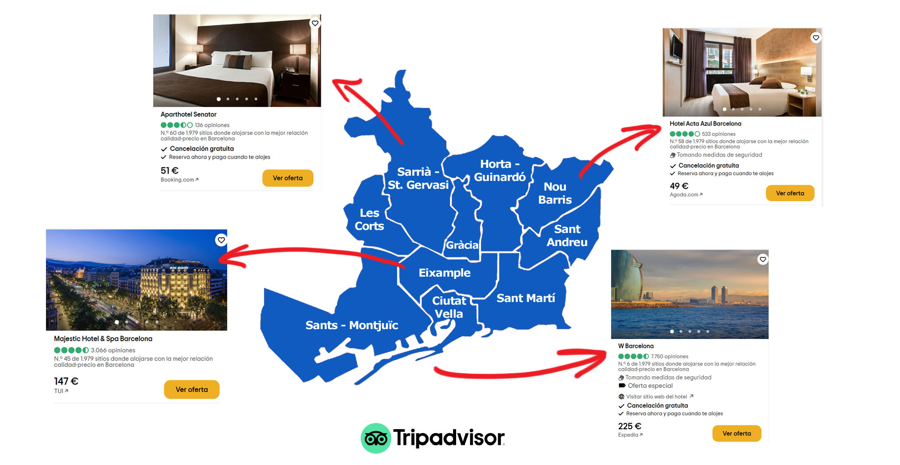

# Descripción

En el presente dataset se recogen una gran variedad de datos sobre los distintos hoteles repartidos a lo largo de la ciudad de Barcelona y alrededores como parte de la práctica 1 de la asignatura Tipología y ciclo de vida de los datos del Máster de Ciencia de datos de la UOC. 

En dicho dataset, compuesto por más de 1500 muestras, se han guardado las distintas variables como son el nombre del hotel, precio por noche o ubicación de este entre otras características. Se puede encontrar la lista entera detallada en el apartado Contenido de este documento. 

A modo de nota, el dataset publicado en el repositorio Zenodo es una simulación de los datos reales para no infringir las políticas de contenido de la web sobre la que se ha basado la práctica.

DOI:

# Contexto

Barcelona es una de las principales ciudades turísticas de España llegando a recibir hasta 12 millones de turistas el pasado año. Gracias a esto, el sector hotelero es uno de los más importantes de la capital de Cataluña generando millones de euros para la ciudad y sus habitantes. Por esto, creímos que sería interesante indagar más sobre el tema y para ello decidimos extraer datos de los hoteles a través de una de las webs de reserva hotelera más utilizadas a escala global, Tripadvisor. 

Tripadvisor es la plataforma de viajes más grande del mundo, la cual proporciona información, opiniones y comentarios sobre alojamientos, restaurantes, experiencias, vuelos, etc. Además, en comparación con otras páginas de la competencia, la página web de Tripadvisor está provista de más herramientas que sus competidores para conseguir la interacción del usuario, cómo foros de viajes, premios basados en las reseñas de los huéspedes... Esto hace que ofrezca una mayor cantidad de información sobre instalaciones, experiencias de usuario etc

# Contenido

Los hoteles se han extraido de Tripadvisor, concretamente a partir de la URL base https://www.tripadvisor.es/Hotels-g187497-Barcelona_Catalonia-Hotels.html, la cual contiene los hoteles situados en Barcelona y en sus inmediaciones. Los datos han sido recopilados usando la técnica de web scraping utilizando el lenguaje Python, y concretamente las librerías Beautiful Soup y Selenium. 

El procedimiento seguido para obtener la información de todos los hoteles ha sido realizar el scraping de todas las páginas (66 en total) y extraer los datos de cada uno de los hoteles mostrados en cada una de ellas, los cuales hemos exportado a CSV.

A continuación, se muestra una lista de todas las variables recogidas para cada hotel y que forman el dataset: 

- Name: Nombre del Hotel 
- Stars: Estrellas del hotel, entre 1 y 5 estrellas
- Score: Calificación del hotel según los usuarios.
- Score Location: Calificación de la ubicación del hotel según los usuarios (de 1.0 a 5.0).
- Score Cleaning: Calificación de la limpieza del hotel según los usuarios (de 1.0 a 5.0).
- Score Service: Calificación del servicio del hotel según los usuarios (de 1.0 a 5.0).
- Score Value for Money: Calificación de la relación calidad/precio del hotel según los usuarios (de 1.0 a 5.0).
- Price: Precio actual por noche del hotel 
- Price Range: Rango de precios por noche en el que se encuentra el hotel
- Ranking: Ranking Tripadvisor del hotel respecto a otro hoteles de la ciudad 
- Number opinions: Número de opiniones dejadas por los huéspedes a través de Tripadvisor
- Number opinions excellent: Número de opiniones excelentes dejadas por los huéspedes a través de Tripadvisor
- Number opinions good: Número de opiniones buenas dejadas por los huéspedes a través de Tripadvisor 
- Number opinions normal: Número de opiniones normales dejadas por los huéspedes a través de Tripadvisor 
- Number opinions bad: Número de opiniones malas dejadas por los huéspedes a través de Tripadvisor 
- Number opinions awful: Número de opiniones pésimas dejadas por los huéspedes a través de Tripadvisor
- Number QA: Número de preguntas y respuestas de los usuarios
- Nearby restaurants: Número de restaurantes cercanos al hotel 
- Nearby attractions: Número de atracciones turísticas cercanas al hotel 
- Zone: Zona en la que se sitúa el hotel 
- Latitude/Longitude: Latitud y longitud del hotel 
- Swimming pool: Nos dice si el hotel dispone de este servicio 
- Bar: Nos dice si el hotel dispone de este servicio 
- Restaurant: Nos dice si el hotel dispone de este servicio 
- Breakfast: Nos dice si el hotel dispone de este servicio 
- Gym: Nos dice si el hotel dispone de este servicio 
- Reception 24h: Nos dice si el hotel dispone de este servicio 
- Admit pets: Nos dice si el hotel dispone de este servicio 
- Air conditioning: Nos dice si el hotel dispone de este servicio
- Strong box: Nos dice si el hotel dispone de este servicio 
- Rooms: Número de habitaciones del hotel
- Suites: Nos dice si el hotel dispone de este tipo de habitaciones
- Sea View Rooms: Nos dice si el hotel dispone de este tipo de habitaciones
- Non-smoking Rooms: Nos dice si el hotel dispone de este tipo de habitaciones
- Landmark View Rooms: Nos dice si el hotel dispone de este tipo de habitaciones
- City View Rooms: Nos dice si el hotel dispone de este tipo de habitaciones
- Family Rooms: Nos dice si el hotel dispone de este tipo de habitaciones
- Style: Estilo del hotel
- Tripadvisor Clasification: Calificación de Tripadvisor sobre la facilidad de realizar actividades y encontrar restaurantes a corta distancia del hotel.
- Language Spanish: Indica si el hotel habla este idioma o no
- Language Catalan: Indica si el hotel habla este idioma o no
- Language French: Indica si el hotel habla este idioma o no
- Language English: Indica si el hotel habla este idioma o no
- Language Italian: Indica si el hotel habla este idioma o no
- Language Bulgarian: Indica si el hotel habla este idioma o no
- Language Russian: Indica si el hotel habla este idioma o no
- Language Portuguese: Indica si el hotel habla este idioma o no
- Prat Distance: Distancia en kilómetros al aeropuerto del Prat
- Timestamp: Fecha/hora de recogida de los datos 

La fecha de recogida de estos datos fue el 2 de noviembre de 2020.

# Inspiración

Cómo se ha mencionado anteriormente el sector hostelero mueve mucho dinero en la ciudad de Barcelona y proporciona empleo a gran parte de su población de forma directa e indirecta. Por estos y otros muchos motivos este dataset podría ayudar en las siguientes situaciones:  

- De los datos recolectados en el dataset se podría generar un informe con los hoteles mejor valorados por los usuarios para la concesión de premios, cómo el World Travel Award. 

- También se podría utilizar para ver cómo están repartidos los hoteles a lo largo de la ciudad, de esta manera el Ayuntamiento de Barcelona podría desarrollar proyectos o dar licencias en áreas con una densidad de hoteles más baja para aumentar el turismo y generar más ingresos en dichas áreas.

- También podría ser interesante realizar algún tipo de algoritmo de clasificación. Por ejemplo, debido a la situación actual del COVID en la cual muchos hoteles están teniendo importantes pérdidas, se podrían clasificar los hoteles según su riesgo económico para así fomentar ayudas a aquellos con un riesgo mayor.

- Imaginemos que una persona desea abrir un hotel en Barcelona. Gracias a este dataset podría descubir en qué zona tendría más potencial de éxito, qué servicios ofrecer que no sean ofrecidos por la competencia, etc. Además, podría predecir el rango de precios al que poner las habitaciones según las características del hotel basándose en los ya existentes en el dataset.

- Supongamos que somos unos turistas rusos y queremos encontrar un hotel que hable este idioma en Barcelona. Desde la web de Tripadvisor no hay ningún filtro de idioma, por lo que el turista debería entrar en todos los hoteles para ver si hablan o no ruso. Sin embargo, en nuestro dataset podemos filtrar por idioma, de forma que esta tarea se agiliza mucho más.

- En la denominada por los medios cómo primera ola de la pandemia que todavía nos afecta hoy en día, se utilizaron hoteles para albergar pacientes Covid y así rebajar la presión que había en los hospitales. Este dataset nos podría ayudar a establecer una lista de hoteles cercanos a los centros hospitalarios que pudieran dar soporte albergando a pacientes de los hospitales ya que conocemos la ubicación y el número de camas de cada hotel. 

# Licencia

La licencia elegida para este dataset es Released Under CC-BY-NC-SA 4.0 License. Basándonos en los términos de dicha licencia creemos que es la que más se ajusta a lo que buscamos ya que: 

- Todos los elementos del dataset son de dominio público. 
- Cualquiera puede utilizar dicho dataset para hacer trabajos derivados o basados en el dataset creado. 
- No se permite hacer uso comercial de este dataset. 
- Dichos trabajos derivados o creados en base a este dataset deben tener una licencia compatible con la original.  

Nos hemos ayudado de esta herramienta del CSIC (Consejo Superior de Investigaciones Científicas) para orientarnos en la elección de la licencia: 

- http://bibliotecas.csic.es/es/node/300 

# Agradecimientos

Queremos agradecer a todos los hostales, apartamentos, hoteles y cadenas hoteleras de la ciudad de Barcelona y alrededores que han publicado su alojamiento en la web Tripadvisor. A su vez, también queremos agradecer a todos los usuarios de Tripadvisor y huéspedes por las reseñas y comentarios publicados. 

También hemos encontrado referencias de otras investigaciones que se han realizado a través de scraping en la web de Tripadvisor. Por ejemplo, el *TripAdvisor Annotated Dataset* (http://nemis.isti.cnr.it/~marcheggiani/datasets/), el cual se centra en las opiniones de los clientes y recoge las valoraciones que les dan a los diferentes aspectos del hotel (habitaciones, limpieza, ubicación, etc.), a parte de la propio comentario, tiene el objetivo de clasificar estas opiniones según sean positivas, negativas o neutrales. 

Otro estudio parecido de la universidad de Illinois (https://www.cs.virginia.edu/~hw5x/paper/rp166f-wang.pdf), estudia el problema de análisis de texto con opinión, llamado *Latent Aspect Rating Analysis (LARA)*, el cual intenta descubrir la opinión latente de cada persona sobre los diferentes aspectos, así como el énfasis que ponen en cada uno al construir una opinión general. Estos datos fueron recogidos de Tripadvisor durante el año 2009.

# Recursos

- https://www.20minutos.es/noticia/4131971/0/barcelona-bate-el-record-historico-al-acoger-a-12-millones-de-turistas-en-2019/
- https://www.worldtravelawards.com/
- http://bibliotecas.csic.es/es/node/300
- https://ufal.github.io/public-license-selector/

# Tabla de contribuciones

| Contribuciones               |      Firma    |
|------------------------------|:-------------:|
| Investigación previa         |  A.G. - M.G.  |
| Redacción de las respuestas  |  A.G. - M.G.  |
| Desarrollo código            |  A.G. - M.G.  |

